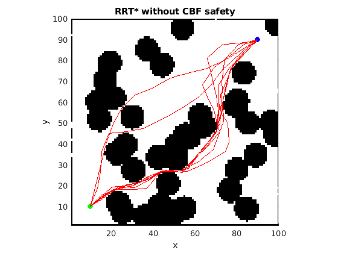
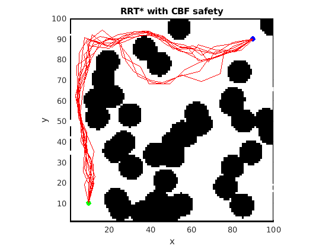
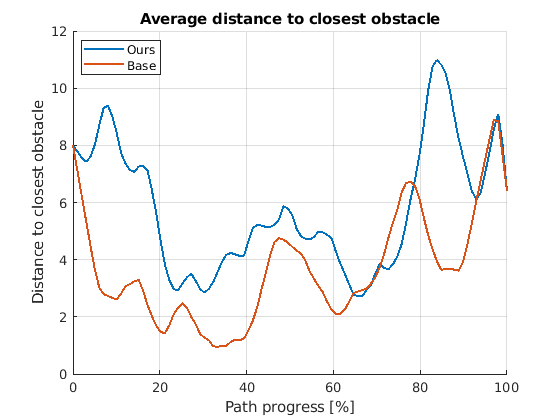
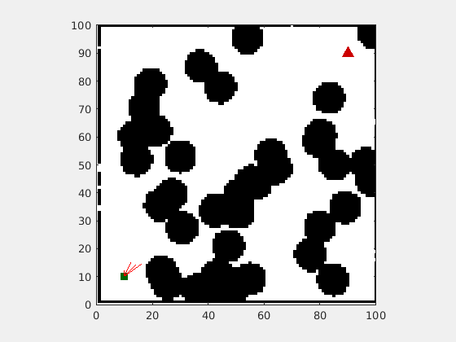
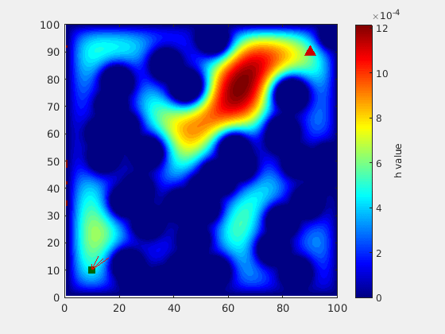

# Safe CBF-RRT*

This repository provides a MATLAB implementation of a safe motion-planning framework based on Rapidly-exploring Random Trees Star (RRT*) augmented with Control Barrier Function (CBF) constraints. The objective is to compute a feasible path that is both efficient and compliant with obstacle-avoidance requirements.

## Overview

The implementation combines two complementary components:

- a safety field $h(x)$, constructed from the environment geometry and obstacle configuration;
- a sampling-based planner that evaluates candidate edges against both collision constraints and CBF-based safety constraints.

This formulation allows the planner to favor trajectories that remain in regions of higher safety margin while still preserving the asymptotic exploration properties of RRT*.

## Method

The pipeline consists of the following stages:

1. Construct a safety function $h(x)$ over the workspace using a Poisson-based formulation.
2. Compute the spatial gradients $\nabla h(x)$, which are used to evaluate local safety variation.
3. Run the Safe CBF-RRT* planner, where each candidate edge is validated against:
   - obstacle occupancy constraints;
   - CBF admissibility conditions.
4. Return a feasible path, together with associated path-length and safety metrics.

## Repository Structure

- [example.m](example.m) — main script for reproducing the example experiment.
- [source/GeneratePoissonSafetyFunction.m](source/GeneratePoissonSafetyFunction.m) — generation of the safety function and its derivatives.
- [source/SafeCBFRRTStar.m](source/SafeCBFRRTStar.m) — implementation of the Safe CBF-RRT* planner.
- [paper/](paper/) — supporting manuscript material, figures, and bibliography.

## Requirements

- MATLAB (recommended) or Octave
- No external dependencies are required.

## Running the Example

1. Open MATLAB or Octave in the repository root.
2. Add the source directory to the MATLAB path:

```matlab
addpath('source');
```

3. Execute the example script:

```matlab
example
```

The script generates several figures illustrating:
- planning without CBF constraints;
- planning with CBF constraints;
- the resulting trajectories in the example environment.

## Parameters

The example in [example.m](example.m) allows modification of several key parameters, including:

- start and goal positions;
- the number of Monte Carlo trials `N`;
- planner settings such as `maxIter`, `stepSize`, `kappa`, `v`, and `do_cbf`.

## Representative Results

The repository includes example visualizations generated from the described procedure:

<!-- 

 -->


### Average distance to obstacle
Base: Average distance to closest objstacle = 3.743 +/- 0.831

Ours: Average distance to closest objstacle = 4.658 +/- 0.326







## Notes

- Setting `do_cbf = true` enables the CBF-based safety constraint.
- Setting `do_cbf = false` recovers the standard RRT* behavior without the safety filter.
- For more demanding scenarios, increasing `maxIter` or tuning `kappa` and `v` may improve feasibility and path quality.

