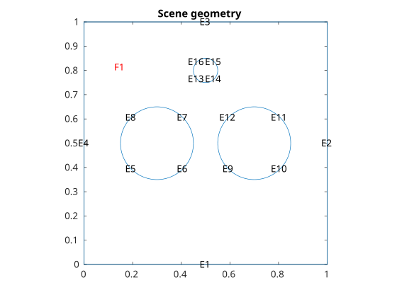
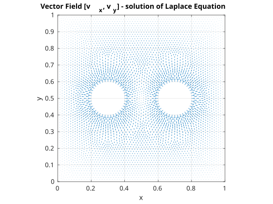
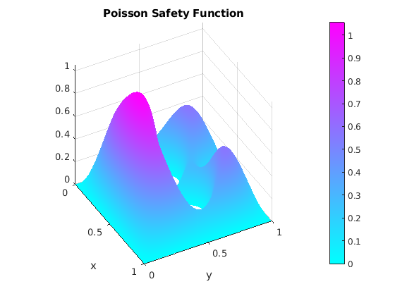
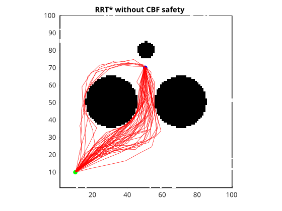
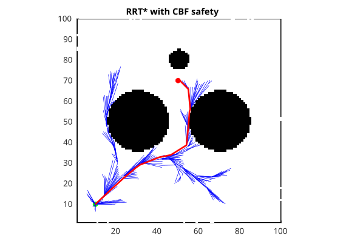
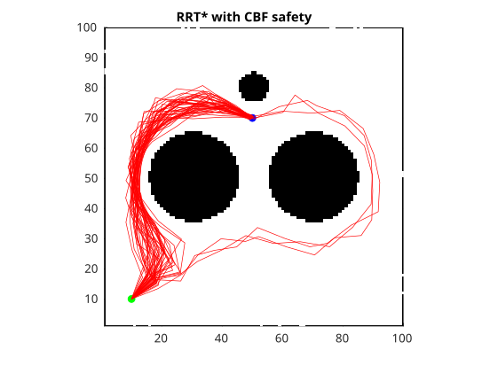
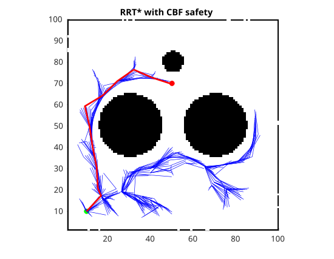

# CBF-RRT*

## Algorithm:
### Find $h(x)$
1. Make contours from grid.
2. Set normal vectors to contours border.
3. Solve Laplace equation -> produce $f(x)$ as force to Poisson equation.
4. Solve Poisson equation 
5. Returns

### Safe RRT*

## Test Scenario
Scene geometry:

Solution of Laplace equation:

output is force in Poisson equation for Poisson
Safety Function $h(x)$.

Solution of Poisson Equation:

Results:
## Without CBF
Results for 50 runs

Single run - produced Tree:

## Without CBF
Results for 50 runs

Single run - produced Tree:

